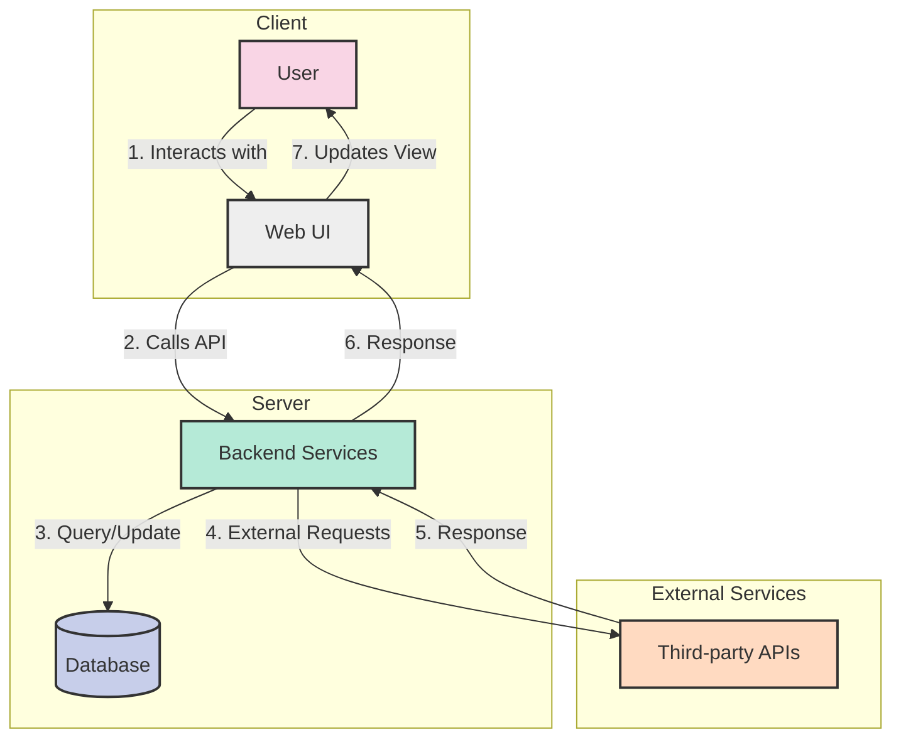
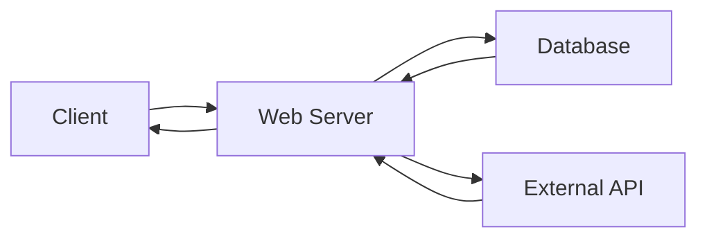
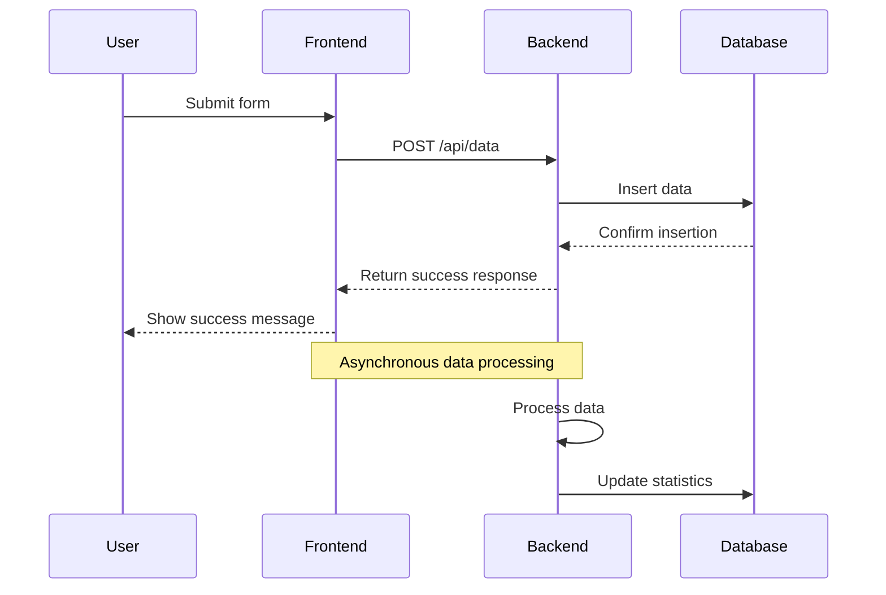
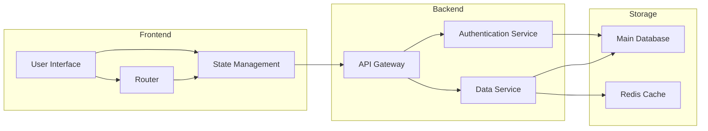

# Communication Flow Diagram

This document demonstrates a communication flow diagram using Mermaid syntax.

## System Communication Flow

The following diagram illustrates the communication flow between a user, frontend application, backend services, database, and external APIs.



## Alternative Simple Flow

For simpler diagrams, the following pattern can be used:



## Sequence Diagram Example

Sequence diagrams are useful for showing the order of interactions between components:



## Component Diagram Example

This diagram shows the relationships between different system components:



## Viewing Mermaid Diagrams

To view these diagrams:
1. Use a Markdown renderer that supports Mermaid (like GitHub, GitLab, or VS Code with a Mermaid extension)
2. Use the Mermaid Live Editor at [https://mermaid.live/](https://mermaid.live/)
3. Copy and paste the code between the ```mermaid tags into the editor 